# SoilRob — Multi-Sensor Data Fusion Platform

**Thermal (FLIR AX8) + LiDAR (KRONOS) + Hyperspectral (HAIP BlackBullet V2) fusion, QA, cross-site semantic alignment, and unified API for the SoilRob project.**

---

## Table of Contents

1. [Overview](#overview)
2. [System Architecture (BPMN)](#system-architecture-bpmn)
3. [Repository Structure](#repository-structure)
4. [File-by-File Description](#file-by-file-description)
5. [Setup &amp; Installation](#setup--installation)
6. [Configuration](#configuration)
7. [Running the Platform](#running-the-platform)
8. [QA Protocol](#qa-protocol)
9. [Cross-Site Semantic Alignment](#cross-site-semantic-alignment)
10. [API Reference](#api-reference)
11. [Docker Deployment](#docker-deployment)
12. [Troubleshooting](#troubleshooting)
13. [Contributing](#contributing)

---

## Overview

SoilRob ingests data from three heterogeneous sensor modalities deployed across **three field sites**:

| Modality               | Hardware            | Interface                        |
| ---------------------- | ------------------- | -------------------------------- |
| Thermal imaging        | FLIR AX8            | Network (IP, MQTT bridge)        |
| LiDAR (soil roughness) | KRONOS LiDAR        | CAN bus (250 kBit, Intel format) |
| Hyperspectral imaging  | HAIP BlackBullet V2 | TCP/IP API (port 7892)           |

This repository combines:

- **Existing production adapters** (`FLIR/`, `HAIP_blackbucketV2/`, `KRONOS_LiDAR/`, `backend/`) — real, hardware-tested integrations.
- **`fusion_platform/`** — a new layer that performs time synchronization, automated QA, cross-site semantic harmonization, and exposes a single unified REST API for downstream consumers (dashboards, ML pipelines, databases).

The fusion layer **wraps** the existing adapters rather than replacing them.

---

## System Architecture (BPMN)

```mermaid
flowchart TB

subgraph POOL[Pool: SoilRob Multi-Site Sensor Fusion]

subgraph L1[Lane: Inject — Site A/B/C]
  A1([Start: Timer/Trigger]) --> A2[Task: Poll Thermal Cam - FLIR AX8]
  A1 --> A3[Task: Read LiDAR CAN frames - 0x123/0x124]
  A1 --> A6[Task: Trigger HSI scan - BlackBullet V2]
  A2 --> A4[/Event: Thermal frame ready/]
  A3 --> A5[/Event: LiDAR frame ready/]
  A6 --> A7[/Event: HSI frame ready/]
end

subgraph L2[Lane: Short-Term API per site]
  A4 --> B1[Task: POST /ingest/thermal/site]
  A5 --> B2[Task: POST /ingest/lidar/site]
  A7 --> B4[Task: POST /ingest/hsi/site]
  B1 --> B3[(Short-term buffer)]
  B2 --> B3
  B4 --> B3
end

subgraph L3[Lane: Sync & QA - Automated]
  B3 --> C1{Gateway: Timestamps match?}
  C1 -->|Yes| C2[Task: Time-align records]
  C1 -->|No, timeout| C3[Task: Emit unmatched record]
  C2 --> C4[Task: Run QA Protocol]
  C3 --> C4
  C4 --> C5{Gateway: QA Pass?}
  C5 -->|Fail| C6[Task: Flag + quarantine]
  C5 -->|Pass| C7[Task: Continue to alignment]
end

subgraph L4[Lane: Cross-Site Semantic Alignment]
  C7 --> D1[Task: Map field names to canonical schema]
  D1 --> D2[Task: Convert units]
  D2 --> D3[Task: Reproject to common CRS]
end

subgraph L5[Lane: Unified API / Publish]
  D3 --> E1[Task: Build FusedRecord]
  E1 --> E2[(Fused store)]
  E2 --> E3[Task: Expose GET /fused/latest, /fused/history, /qa/summary]
  E3 --> E4([End: Consumers - Dashboard/ML/DB])
end

C6 --> E3

end
```



---

## Repository Structure

```
SoilRob/
├── Dockerfile
├── README.md                              ← this file
├── .gitignore
├── main.py
├── requirements.txt
│
└── fusion_platform/
    ├── .vscode/
    │   ├── launch.json
    │   └── settings.json
    ├── config/
    │   └── sites.yaml
    ├── src/
    │   ├── __init__.py
    │   ├── adapters/
    │   │   ├── __init__.py
    │   │   ├── thermal_adapter.py
    │   │   ├── lidar_adapter.py
    │   │   └── hsi_adapter.py
    │   ├── qa/
    │   │   ├── __init__.py
    │   │   └── qa_protocol.py
    │   ├── semantic/
    │   │   ├── __init__.py
    │   │   └── alignment.py
    │   ├── fusion/
    │   │   ├── __init__.py
    │   │   └── fusion_engine.py
    │   └── api/
    │       ├── __init__.py
    │       └── unified_api.py
    ├── main.py
    └── requirements.txt
```

---

## File-by-File Description

### Root level

| File           | Purpose                                                                                                  |
| -------------- | -------------------------------------------------------------------------------------------------------- |
| `Dockerfile` | Container build definition for deploying the SoilRob backend/platform.                                   |
| `.gitignore` | Excludes virtual environments,`__pycache__`, `.env`, and other build artifacts from version control. |
| `README.md`  | Project documentation (this file).                                                                       |

### `FLIR/` — Thermal camera integration

| File               | Purpose                                                                                                                                                   |
| ------------------ | --------------------------------------------------------------------------------------------------------------------------------------------------------- |
| `FLIR AX.py`     | Core driver/interface for the FLIR AX8 thermal camera — handles connection, spot temperature readings, and image mode switching (Thermal / Thermal MSX). |
| `MQTT_BRIDGE.py` | Publishes thermal camera readings to an MQTT broker for real-time streaming to other services (e.g., dashboards, the fusion engine).                      |
| `soil_rob.py`    | SoilRob-specific integration logic tying the FLIR camera into the robot's onboard data pipeline (capture triggers, GPS timestamp matching).               |

### `HAIP_blackbucketV2/` — Hyperspectral camera integration

| File                | Purpose                                                                                                                                                                                                                                                                                                                                            |
| ------------------- | -------------------------------------------------------------------------------------------------------------------------------------------------------------------------------------------------------------------------------------------------------------------------------------------------------------------------------------------------- |
| `Black_Bucket.py` | Python class wrapping the HAIP BlackBullet V2 TCP/IP API (port 7892) — handles serial number/version queries, gain/exposure settings, HSI image triggering, and file download (`.img`, `.hdr`, `.tif`, `.png`). Based on the 16-byte command packet protocol (`sensor`, `getset`, `b_code`, `value1`, `value2`, `timestamp`). |

### `KRONOS_LiDAR/` — LiDAR integration

| File                | Purpose                                                                                                                                                                           |
| ------------------- | --------------------------------------------------------------------------------------------------------------------------------------------------------------------------------- |
| `CAN_bus`         | CAN interface configuration/helper for connecting to the LiDAR over SocketCAN (250 kBit, Intel/little-endian format).                                                             |
| `kronos_lidar.py` | Decodes LiDAR CAN frames — Control message (`0x123`: mode, opening angle) and Status message (`0x124`: mode, opening angle, error code, warning code, roughness parameters). |

### `backend/` — Existing production API

| File                 | Purpose                                                                                                |
| -------------------- | ------------------------------------------------------------------------------------------------------ |
| `main.py`          | Existing backend API entry point serving SoilRob sensor data prior to the fusion platform integration. |
| `requirements.txt` | Python dependencies for the existing backend service.                                                  |

### `fusion_platform/` — Fusion, QA, semantic alignment, unified API layer

| File                                | Purpose                                                                                                                                                                                                                                     |
| ----------------------------------- | ------------------------------------------------------------------------------------------------------------------------------------------------------------------------------------------------------------------------------------------- |
| `main.py`                         | Entry point that loads`config/sites.yaml`, starts thermal/LiDAR/HSI pollers per site, wires them into the `FusionEngine`, and launches the unified FastAPI server via `uvicorn`. **Run this file to start the whole platform.** |
| `requirements.txt`                | Python dependencies specific to the fusion platform (`fastapi`, `uvicorn`, `pandas`, `pyproj`, `python-can`, etc.).                                                                                                               |
| `config/sites.yaml`               | Central configuration: per-site IPs/CAN channels, native CRS, fusion time tolerance, QA thresholds, and API host/port.                                                                                                                      |
| `.vscode/launch.json`             | VS Code debug configuration — press`F5` to run `main.py` directly.                                                                                                                                                                     |
| `.vscode/settings.json`           | VS Code workspace settings (Python analysis paths,`PYTHONPATH`).                                                                                                                                                                          |
| `src/adapters/thermal_adapter.py` | Threaded poller that reads thermal data (wraps/calls into`FLIR/soil_rob.py` or `FLIR/FLIR AX.py`) and forwards readings to the fusion engine.                                                                                           |
| `src/adapters/lidar_adapter.py`   | Threaded poller that reads LiDAR CAN status frames (wraps/calls into`KRONOS_LiDAR/kronos_lidar.py`) and decodes them per the datasheet protocol.                                                                                          |
| `src/adapters/hsi_adapter.py`     | Adapter wrapping`HAIP_blackbucketV2/Black_Bucket.py` for hyperspectral image triggering and ingestion into the fusion pipeline.                                                                                                           |
| `src/qa/qa_protocol.py`           | Automated QA checks:**completeness**, **outlier detection** (IQR/z-score), **CRS validation**, **temporal consistency**. Runs automatically on every fused record.                                                  |
| `src/semantic/alignment.py`       | Cross-site semantic harmonization: maps each site's raw field names to a canonical schema, converts units (°F→°C, mm→cm, K→°C), and documents each site's native sampling protocol.                                                   |
| `src/fusion/fusion_engine.py`     | Core engine: buffers per-site thermal/LiDAR/HSI readings, time-aligns them within a configurable tolerance, runs the QA pipeline, and stores passed records in the fused buffer (failed records go to quarantine).                          |
| `src/api/unified_api.py`          | FastAPI app exposing ingestion endpoints (`/ingest/thermal/{site}`, `/ingest/lidar/{site}`) and consumption endpoints (`/fused/latest`, `/fused/history`, `/qa/summary`, `/health`).                                            |

---

## Setup & Installation

### Prerequisites

- Python 3.9+
- Git
- (Optional, for LiDAR) SocketCAN-compatible interface/driver on Linux, or a CAN-USB adapter with appropriate driver on Windows
- VS Code (recommended)

### Clone and set up

```bash
git clone https://github.com/Meet2197/SoilRob.git
cd SoilRob
```

### Install existing backend dependencies

```bash
cd backend
pip install -r requirements.txt
cd ..
```

### Install fusion platform dependencies

```bash
cd fusion_platform
python -m venv .venv
# Windows:
.venv\Scripts\activate
# macOS/Linux:
source .venv/bin/activate

pip install -r requirements.txt
```

---

## Configuration

Edit `fusion_platform/config/sites.yaml` to match your real deployment:

```yaml
sites:
  site_A:
    crs_native: "EPSG:4326"
    thermal:
      ip: "192.168.1.20"
      port: 80
      poll_hz: 1
    lidar:
      can_channel: "can0"
      bitrate: 250000
      control_id: 0x123
      status_id: 0x124
  # site_B, site_C follow the same pattern

fusion:
  time_tolerance_s: 0.2
  buffer_size: 5000

qa:
  completeness_threshold: 0.95
  outlier_method: "iqr"
  outlier_k: 1.5
  max_temporal_gap_s: 5.0
  expected_crs: "EPSG:4326"

api:
  host: "0.0.0.0"
  port: 8000
```

> Update the IP addresses to match your FLIR AX8 network configuration, and the CAN channel names to match your actual SocketCAN/USB-CAN interfaces per site.

---

## Running the Platform

### Option 1 — VS Code (recommended)

1. Open the `fusion_platform/` folder in VS Code.
2. Select the `.venv` interpreter (`Ctrl+Shift+P` → *Python: Select Interpreter*).
3. Press **F5** (uses `.vscode/launch.json`).
4. The unified API starts at `http://localhost:8000`.

### Option 2 — Command line

```bash
cd fusion_platform
python main.py
```

### Verify it's running

```bash
curl http://localhost:8000/health
curl http://localhost:8000/fused/latest
curl http://localhost:8000/qa/summary
```

### Running the existing backend separately (if still needed)

```bash
cd backend
python main.py
```

---

## QA Protocol

Every fused record automatically passes through four checks in `src/qa/qa_protocol.py`:

| Check                          | Method                                                       | Fail condition                                 |
| ------------------------------ | ------------------------------------------------------------ | ---------------------------------------------- |
| **Completeness**         | Verifies required fields are non-null                        | Any required field missing                     |
| **Outlier detection**    | IQR (default) or z-score against recent history              | Value outside`Q1 - k·IQR` / `Q3 + k·IQR` |
| **CRS validation**       | Compares record CRS against expected CRS via`pyproj`       | CRS mismatch or invalid                        |
| **Temporal consistency** | Compares gap since last record against`max_temporal_gap_s` | Gap exceeds threshold                          |

Records that fail any check are routed to the **quarantine buffer** (accessible via internal engine state) instead of the published fused buffer. All checks and their pass/fail status are logged and retrievable at `GET /qa/summary`.

---

## Cross-Site Semantic Alignment

`src/semantic/alignment.py` maps each site's raw sensor field names and units into one **canonical schema**:

```
record_id, site_id, sensor_type, timestamp_utc,
temperature_c, scan_angle_deg, range_m, roughness_cm,
error_code, warning_code, latitude, longitude,
elevation_m, crs
```

Unit conversions handled automatically:

- Fahrenheit → Celsius
- Kelvin → Celsius
- Millimeters → Centimeters

Each site's native sampling protocol (acquisition mode, frequency) is documented in `SAMPLING_PROTOCOLS` for provenance/traceability.

---

## API Reference

| Method   | Endpoint                      | Description                                 |
| -------- | ----------------------------- | ------------------------------------------- |
| `POST` | `/ingest/thermal/{site_id}` | Ingest a raw thermal reading for a site     |
| `POST` | `/ingest/lidar/{site_id}`   | Ingest a raw LiDAR CAN reading for a site   |
| `GET`  | `/fused/latest`             | Get the most recent fused, QA-passed record |
| `GET`  | `/fused/history?n=100`      | Get the last`n` fused records             |
| `GET`  | `/qa/summary?n=50`          | Get the last`n` QA check reports          |
| `GET`  | `/health`                   | Health check                                |

Interactive API docs available at `http://localhost:8000/docs` (Swagger UI, auto-generated by FastAPI).

---

## Docker Deployment

```bash
docker build -t soilrob-platform .
docker run -p 8000:8000 soilrob-platform
```

> If `fusion_platform` needs to run in the same container as `backend`, update the `Dockerfile` to install both `backend/requirements.txt` and `fusion_platform/requirements.txt`, and set the container `CMD` to launch `fusion_platform/main.py`.

---

## Troubleshooting

| Problem                                  | Cause                                     | Fix                                                             |
| ---------------------------------------- | ----------------------------------------- | --------------------------------------------------------------- |
| `python-can not installed - skipping`  | Missing CAN library                       | `pip install python-can`                                      |
| CAN bus open failed                      | Wrong channel name or interface not up    | On Linux:`sudo ip link set can0 up type can bitrate 250000`   |
| Thermal poller read errors               | Wrong IP/port or camera unreachable       | Verify FLIR AX8 network config, check`ping <camera_ip>`       |
| `git push` rejected (non-fast-forward) | Remote has commits you don't have locally | `git pull --rebase origin main`, resolve conflicts, then push |
| Fused records always empty               | Timestamps not within`time_tolerance_s` | Increase tolerance in`sites.yaml` or check sensor clock sync  |

---

## Contributing

1. Create a feature branch: `git checkout -b feature/your-feature`
2. Make changes inside the relevant module (`fusion_platform/src/...`)
3. Test locally: `python fusion_platform/main.py`
4. Commit: `git commit -m "Description of change"`
5. Push: `git push origin feature/your-feature`
6. Open a Pull Request against `main`

---

**Maintainer:** Meet2197
**Repository:** [github.com/Meet2197/SoilRob](https://github.com/Meet2197/SoilRob)
